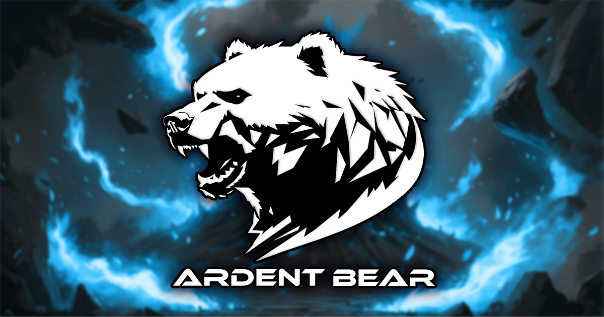

# Ardent Bear D.O.O.
## Expert Full-Cycle Game Development

> We are the strategic partner that transforms ambitious visions into market-leading interactive experiences.

[//]: # ()

 

## Who We Are

Ardent Bear is a specialist game development studio built to execute high-caliber gaming projects from concept to completion. We operate as a foundational development powerhouse for companies looking to make a significant impact in the games industry, from film production houses expanding their IP to established publishers seeking expert execution.

Our integrated team of industry veterans, led by development specialist Predrag Siljanoski and art director Nikola Radovic, works seamlessly to deliver complete, polished games that stand out in today's competitive market.

## Our Expertise

### 🎮 Full-Cycle Game Development
- Complete project development from initial concept (0) to post-launch support (100)
- Pre-production, including Game Design Document (GDD) creation and prototyping
- Production planning and management
- Live service implementation and maintenance

### 💻 Game Programming & Engineering
- Expert-level development in Unreal Engine and Unity
- Gameplay mechanics, AI systems, tools programming, and networking
- Backend development for live service games
- DevOps and infrastructure management

### 🎨 Game Art & Animation
- Concept Art: Characters, environments, props
- 2D Art: Characters, environments, UI/UX assets
- 3D Art: High & low poly modeling for characters, environments, and hard-surface items
- Animation: 2D and 3D character animation and rigging

### ✨ Visual Effects (VFX)
- Creating impactful, real-time visual effects for gameplay and cinematics

### 🛠️ Production Support & Optimization
- Production fixing for existing projects to improve performance and stability
- QA and technical support services

## What Sets Us Apart

- **Expert, Authoritative Execution**: We are seasoned specialists who provide direct, no-nonsense leadership and execution on projects.
- **True Full-Cycle Partnership**: We have the capability and structure to be the foundational "gaming arm" for companies, not just a temporary outsourcer.
- **Integrated Art & Development**: Our cohesive team structure ensures that world-class art direction is fundamentally linked to technical development from day one.
- **Platform Versatility**: Proven capability to develop for all major platforms: PlayStation, Xbox, Steam (PC), Nintendo, Android, and iOS.

## Our Philosophy

We don't just manage parts of a project; we command the entire creation pipeline, ensuring a cohesive vision and uncompromising quality at every stage. We thrive on ambitious challenges and operate with the precision, creative force, and directness necessary to turn visionary ideas into unforgettable games.

Ardent Bear is the definitive solution for clients who demand excellence.

## Connect With Us

- 🌐 [Website](https://ardentbear.com)
- 📧 [Contact Us](mailto:info@ardentbear.com)
- 🔗 [LinkedIn](https://linkedin.com/company/ardentbear)

---

© 2025 Ardent Bear D.O.O. All rights reserved.
